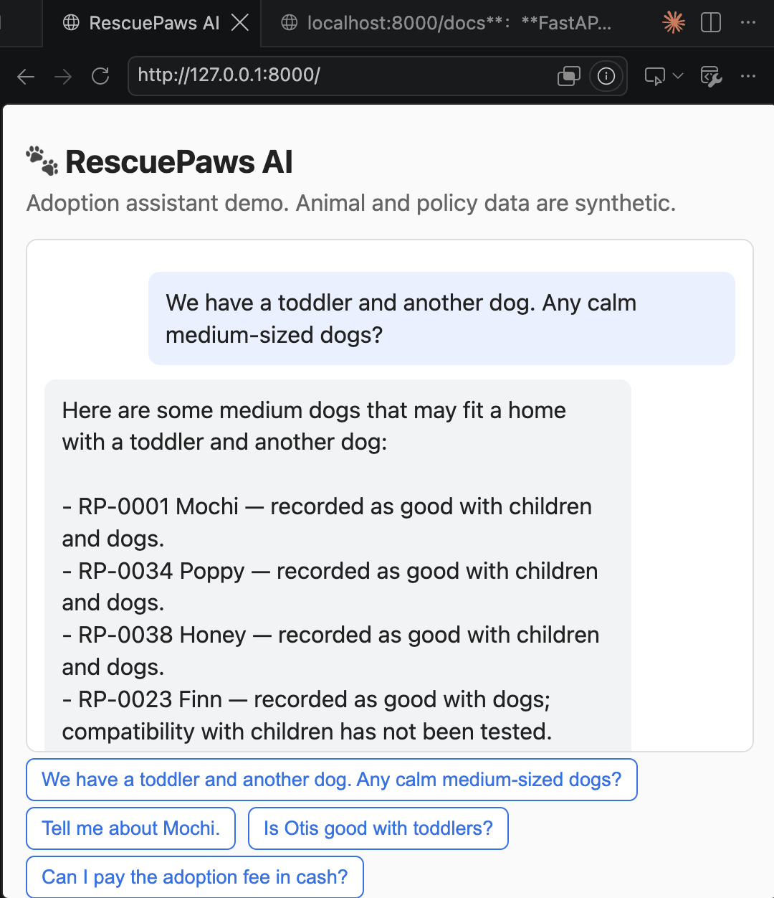
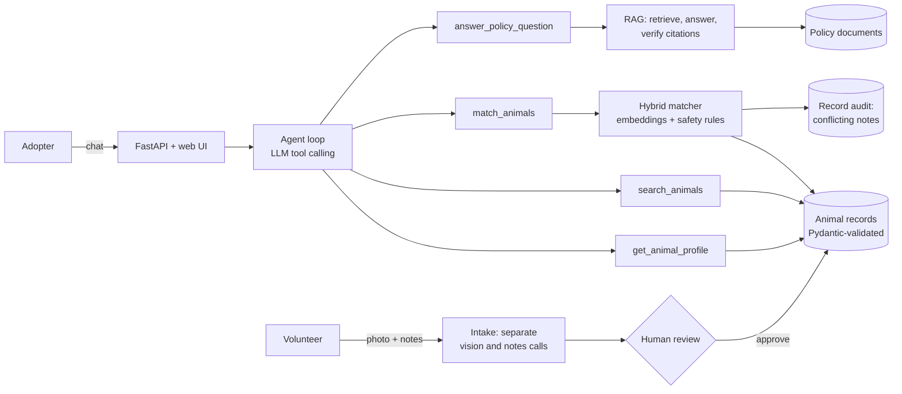

# RescuePaws AI

[](https://github.com/itsxiaoshen/rescuepaws-ai/actions/workflows/ci.yml)

An AI adoption assistant for a volunteer-run animal shelter caring for 500+ rescued
animals. An LLM agent chooses among tools for animal lookup, semantic adopter matching,
and policy Q&A grounded in shelter documents. It never guesses an animal's health,
temperament, or safety around children, dogs, or cats.



## At a glance

- **Problem:** Animal information lives in scattered volunteer notes, and a small volunteer
  team does all the work of matching adopters with suitable animals and answering the same
  policy questions again and again.
- **What it does:** Adopters describe their household in plain language. The agent finds
  matching animals and explains *why* each one fits and *what is still unknown*. It answers
  policy questions with citations, and it helps volunteers turn a photo plus notes into a
  draft profile.
- **Safety principle:** Unknown stays unknown. A dog that has never been tested with
  children is never presented as good with children.
- **Evidence:** Every component has its own evaluation, and each eval is run several
  times because LLM output varies. Results are in [eval/eval_results.md](eval/eval_results.md).

| Component | Key result |
|---|---|
| Adoption matching | Constraint violations: **16/17 cases → 0/17** vs. semantic search alone; MRR@5 0.57 → 0.94 |
| Policy retrieval | Hit@3 **0.96** (dev) / **0.90** (held-out), up from 0.92 / 0.80 after a model comparison |
| Grounded answers | Unanswerable questions declined **100%** of the time (40 questions × 6 runs); answers judged fully grounded by a validated LLM judge: 0.95–0.98 |
| Agent | **20/20** scenarios, including failure cases, on 3 consecutive runs |
| Multimodal intake | **47/47** fields correct; **0** compatibility claims without evidence |

All datasets are small, synthetic, and hand-labeled. See [Limitations](#limitations).

## Architecture



### Why it's agentic

RAG is one tool among four. The LLM decides which tools a request needs, fills in their
arguments (for example, it turns "we have a toddler and another dog" into
`has_children=true, has_dogs=true`), and chains tools across turns: match, then inspect
a candidate, then answer a policy question about that animal. The agent loop is about
20 lines of plain Python with a step limit, so every step can be logged and tested.

## How it works

**Data model** (`src/schemas.py`): Animal profiles are Pydantic models.
Compatibility is `yes / no / unknown`, never a boolean, and each claim records its source
in an `evidence` field. A data-quality test fails if any "yes" or "no" has no evidence.

**Matching** (`src/matching.py`): Embeddings rank animals by how well their description
fits the request. Structured rules enforce safety: unavailable animals and animals
recorded as "no" for the household are excluded, and animals with untested compatibility
are shown in a separate group with the unknowns spelled out. Compatibility is deliberately
kept out of the embedded text: in a test, "good with children: yes" and "good with
children: unknown" had a cosine similarity of 0.85.

**Record audit** (`src/record_audit.py`): An offline LLM pass finds animals marked
"good with X" whose notes describe a worrying incident with X. Matching then shows them
as "conflicting records, ask staff" instead of as confirmed matches. The audit runs when
records change, not on every search, and its output is a file staff can review.

**Policy Q&A** (`src/rag.py`): Section-based chunking, retrieval with
`bge-small-en-v1.5`, and an answer step that must cite the excerpts it used. Code checks
that every citation points to an excerpt the model was actually given. Answers without
a valid citation become "I couldn't find that in the policy documents."

**Intake** (`src/intake.py`): The photo and the volunteer notes go to two separate
LLM calls. The photo's output schema has no fields for temperament, age, health, or
compatibility, so those can't be inferred from appearance. Every compatibility,
vaccination, or sterilization value needs a quote that appears in the notes. New
profiles stay on hold until a volunteer approves them.

**LLM provider** (`src/llm.py`): The only module that talks to the LLM API, so switching
providers is a one-file change. Unit tests replace it with scripted fakes and never call
the API.

## What I learned from the evaluations

- **Narrow questions beat clever prompts.** Asking the LLM to "find contradictions" in
  records flagged 7 animals, 6 of them wrongly. Moving the logic into code (check only
  fields recorded as "yes") and asking one narrow question per field found the real
  conflict on 3/3 runs with no false positives.
- **"Industry standard" isn't automatically better.** Hybrid BM25 + embedding search
  *lowered* held-out Hit@3 from 0.80 to 0.60 on deliberately paraphrased questions. A
  retrieval-specific embedding model raised it to 0.90. The model was chosen on a dev
  set and confirmed on a held-out set.
- **Run evals more than once.** A hallucination ("No, pet insurance isn't included",
  when the documents never mention insurance) appeared in 1 of 3 runs and passed the
  citation check. A validated LLM judge caught it.
- **Validate the judge.** The first judge version flagged correct "Yes."/"No." answers
  because it didn't see the question. It's now checked against 15 labeled answers with
  planted errors.

## Limitations

- Small, synthetic, hand-labeled datasets (45 animals, 34 policy chunks, 20 agent
  scenarios). The numbers show the system works on designed cases, not production accuracy.
- Keyword-based checks in the agent eval are coarse. Policy answers use an LLM judge;
  agent replies don't yet.
- Conversations are stored in memory: lost on restart and limited to one server process.
- The record audit only checks compatibility fields marked "yes".

## Future work

- Persistent conversation storage (e.g. Redis), authentication, and per-user rate limits.
- Real shelter data integration with role-based access for staff and volunteers.
- Adoption inquiry tracking, volunteer task routing, and a Chinese-English bilingual assistant.
- Donation and expense reporting for donor transparency.

## Run locally

```bash
python3 -m venv .venv && source .venv/bin/activate
pip install -r requirements.txt
cp .env.example .env              # then add your OPENAI_API_KEY
pytest                            # no API key needed: LLM calls are faked in tests
uvicorn app.api:app --reload --reload-dir app --reload-dir src
```

Open http://127.0.0.1:8000 for the chat UI or http://127.0.0.1:8000/docs for the API.

Other entry points:

```bash
python -m src.chat                     # chat in the terminal
python -m src.intake_cli --photo data/intake_photos/black_dog.jpg --notes "Name: Shadow. Male, neutered."
python -m src.record_audit             # re-run the record audit after data changes
python -m eval.run_matching_eval       # evaluations (the ones that call the LLM cost a few cents)
```

## Run with Docker

```bash
docker build -t rescuepaws-ai .
docker run -p 8000:8000 --env-file .env rescuepaws-ai
```

The API key is passed at runtime and is never copied into the image. CI builds the image
and smoke-tests the running container on every push.

## Repository layout

```
src/        data model, matching, RAG, record audit, intake, tools, agent, LLM wrapper
app/        FastAPI service and web UI
data/       synthetic animal records, policy documents, intake test photos
eval/       evaluation sets, scripts, LLM judge, and results log
tests/      unit and API tests (no API calls)
docs/       roadmap and dataset notes
```

## Data and credits

All animal records and policy documents are synthetic. No real adopter, volunteer, or
medical data is included. Photo credits are in
[data/intake_photos/CREDITS.md](data/intake_photos/CREDITS.md).
